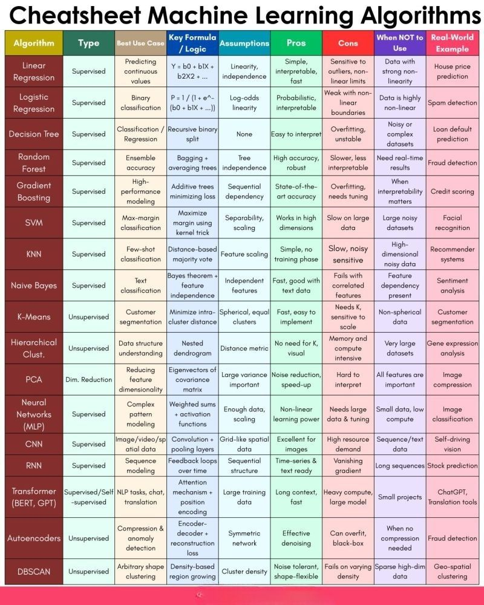

# ML

Job of a `data scientist/analyst` is to find the best `algorithm` for a given problem
and make sure that the data when `modeled` is consumable by the `algorithm`.

## Roadmap

  ### Statistics and Maths

  - differential equations
  - linear algebra
  - matrix multiplications
  - scalars
  - vector
  - matrix
  - probability

### Skills
1. Prog Lang: Python or R
2. Stats & Maths: differential equations, linear algebra, matrix multiplication, vector, matrices, scalas, probability
3. dbms: sql, no sql: mongodb, cassandra, dynamodb (aws)
4. ml & dl: advanced dl (object detection, euler algo, kinds of transfer learnings), libraries related to dl: tensorflow, keras, pytorch
5. big data: basic arch. for hadoop (small proj), pig, hive, flumes
6. nlp: chatbots, sentiment analysis - political, stock market via news; nlu - conversational ai chatbots
7. git: bitbucket, git cli
8. reporting tools: power bi, tableau, qlicksense
9. deployment techniques: azure, aws, cloud frontry, heroku (platform as a service) paas vs iaas, differences b/w them, adv, disadv
10. cloud computing services: azure, aws - kinesis stream, s3 bucket
11. devops: kubernetes, docker

ref: [https://www.youtube.com/watch?v=8Q5F_AQ9OGo](https://www.youtube.com/watch?v=8Q5F_AQ9OGo)

## Projects

[Using Machine Learning to Replicate Airbnb's Amenity Detection Part 1: Overview](https://youtu.be/C_lIenSJb3c)

All videos in this series:

Full playlist - https://dbourke.link/airbnbplaylist

Part 1 (overview) - https://youtu.be/C_lIenSJb3c

Part 2 (data exploration) - https://youtu.be/hTHXVfryZDo

Part 3 (data manipulation) - https://youtu.be/cijajMJ3m3w

Part 4 (building a small dog model) - https://youtu.be/ooB-ZU9iLmI

Part 5 (experiment tracking) - https://youtu.be/83s-OEFMgVY

Part 6 (modelling experimentation) - https://youtu.be/eiA3EEeGAZc

Part 7 (building a big dog model) - https://youtu.be/5X6A1i5wbFU

Part 8 (getting my modelling deployed) - https://youtu.be/smlQbh6jQvg

Part 9 (project wrap up and retrospective) - https://youtu.be/aBkUE5OJ8u8
       
## Book Recomendation

### Top rated books

**Review**

[These books will help you learn machine learning](https://youtu.be/7R08MPXxiFQ)

**Book links (in order):**

Machine Learning For Humans - https://bit.ly/mlforhumansbook

Python for Data Analysis - https://amzn.to/2Z1QZNp

Hands-on Machine Learning with Scikit-Learn and TensorFlow - https://amzn.to/2GormNb

Grokking Deep Learning - https://amzn.to/2H497My

The Mechanics of Machine Learning - https://mlbook.explained.ai/

The Hundred-Page Machine Learning Book (online) - https://bit.ly/100pageMLbookhome

The Hundred-Page Machine Learning Book (buy) - https://bit.ly/100pagemlbook

The Deep Learning Book (online) - https://www.deeplearningbook.org/

The Deep Learning Book (buy) - https://amzn.to/2YIsGok

**Reviews**

[The Hundred-Page Machine Learning Book Review](https://youtu.be/btLxTTkSZuY)

My favourite ML/AI resources - https://bit.ly/AIMLresources

## Tools

[21 Must-Know Open Source Tools for Machine Learning you Probably Aren’t Using (but should!)](https://www.analyticsvidhya.com/blog/2019/07/21-open-source-machine-learning-tools/)

## Courses

- [AI For Everyone](https://www.coursera.org/learn/ai-for-everyone) (free)

## 🚀 𝗠𝗮𝘀𝘁𝗲𝗿𝗶𝗻𝗴 𝗠𝗮𝗰𝗵𝗶𝗻𝗲 𝗟𝗲𝗮𝗿𝗻𝗶𝗻𝗴 𝗔𝗹𝗴𝗼𝗿𝗶𝘁𝗵𝗺𝘀 – 𝗠𝗮𝗱𝗲 𝗦𝗶𝗺𝗽𝗹𝗲! 🚀

Feeling overwhelmed by the countless algorithms in Machine Learning?
You’re not alone.

Here’s a powerful cheatsheet that breaks down 20+ popular ML algorithms at a glance:

📚 𝗧𝘆𝗽𝗲: Supervised, Unsupervised, Dimensionality Reduction

🎯 𝗕𝗲𝘀𝘁 𝗨𝘀𝗲 𝗖𝗮𝘀𝗲𝘀: From predicting house prices to fraud detection

🧠 𝗖𝗼𝗿𝗲 𝗟𝗼𝗴𝗶𝗰 & 𝗔𝘀𝘀𝘂𝗺𝗽𝘁𝗶𝗼𝗻𝘀: Understand how and why they work

✅ 𝗣𝗿𝗼𝘀 & ❌ 𝗖𝗼𝗻𝘀: When to use, and when to avoid

🌍 𝗥𝗲𝗮𝗹-𝗪𝗼𝗿𝗹𝗱 𝗘𝘅𝗮𝗺𝗽𝗹𝗲𝘀: Connect theory to real applications

𝗔 𝗳𝗲𝘄 𝗵𝗶𝗴𝗵𝗹𝗶𝗴𝗵𝘁𝘀:

🔹 𝗟𝗶𝗻𝗲𝗮𝗿 𝗥𝗲𝗴𝗿𝗲𝘀𝘀𝗶𝗼𝗻 – Perfect for predicting continuous values like house prices.

🔹 𝗥𝗮𝗻𝗱𝗼𝗺 𝗙𝗼𝗿𝗲𝘀𝘁 – High accuracy and robustness, ideal for complex classification tasks.

🔹 𝗡𝗲𝘂𝗿𝗮𝗹 𝗡𝗲𝘁𝘄𝗼𝗿𝗸𝘀 – The powerhouse behind image and voice recognition systems.

🔹 𝗞-𝗠𝗲𝗮𝗻𝘀 𝗖𝗹𝘂𝘀𝘁𝗲𝗿𝗶𝗻𝗴 – A go-to method for customer segmentation.

💡 Whether you're a beginner or an experienced practitioner, keeping these insights at your fingertips will sharpen your model selection skills — and save you hours of confusion.

